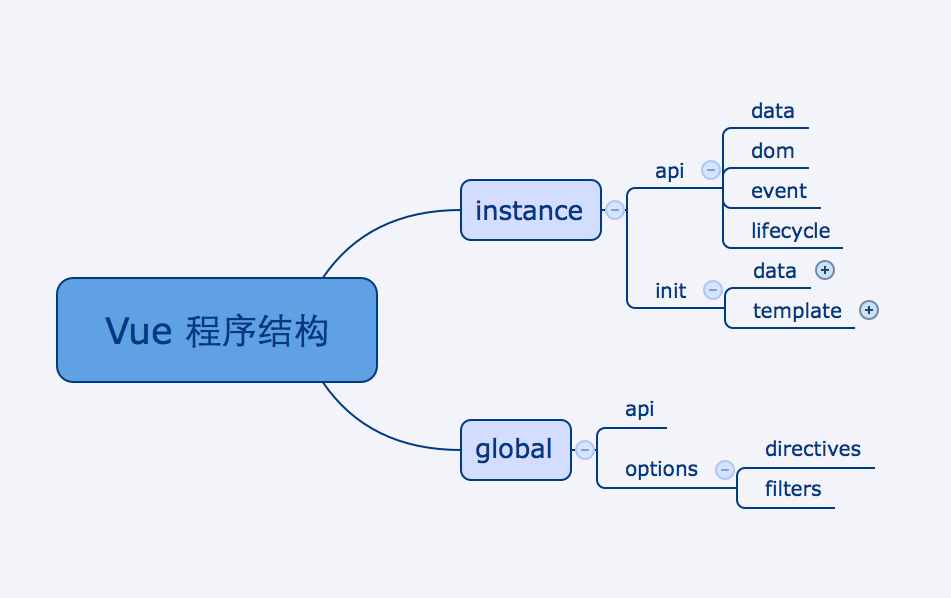
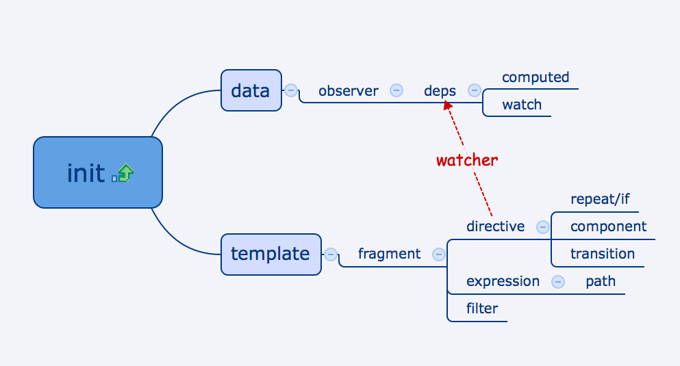
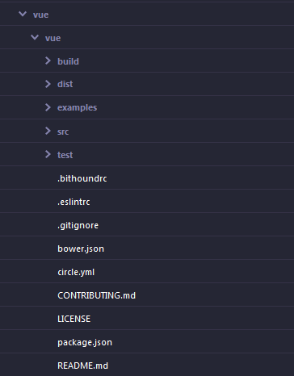
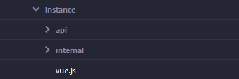
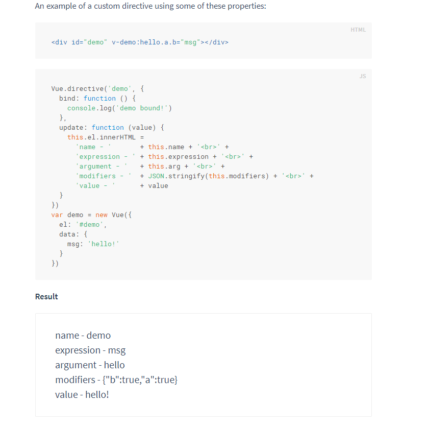
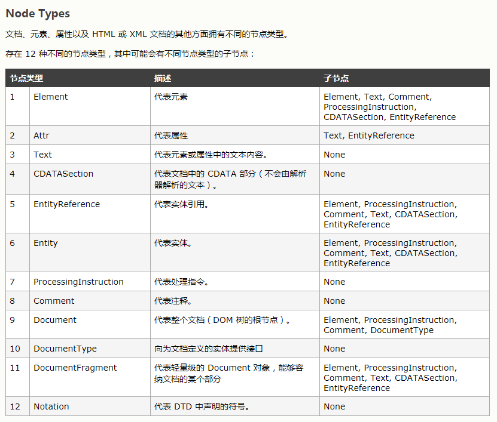

> 使用尤大的 Vue.js 快一年了，让我爱上了单页面应用开发，单页面路由让前后端基本分离开，数据绑定虚拟Dom让前端开发更加迅速，不再每次更新数据都要手动修改dom树等等，不过一直停留在使用的阶段，于是想看看vue底层是怎么实现的，框架是怎么搭建起来的，便 fork 了整个项目，一边看一边记下这些笔记

## [囧克斯的一篇源码解析文章](http://jiongks.name/blog/vue-code-review/)

> 以下摘自囧克斯博客的一篇文章

Vue.js 是一个典型的 MVVM 框架，整个程序从最上层分为

* 1 全局设计：包括全局接口、默认选项
* 2 vm 实例设计： 包括接口设计（vm 原型）、实例初始化过程设计（vm构造函数）



构造函数核心的工作内容：



整个实例初始化过程，关键在于将 数据(Model) 和 视图（view）建立起关联关系：

* 通过 observer 对 data 进行了监听，并且提供订阅某个数据项的变化的能力
* 把 template 解析成一段 document fragment，然后解析其中的 directive，得到每一个 directive 所依赖的数据项及其更新方法。比如 v-text="message" 被解析之后 (这里仅作示意，实际程序逻辑会更严谨而复杂)：
    * 所依赖的数据项 this.$data.message，以及
    * 相应的视图更新方法 node.textContent = this.$data.message
* 通过 watcher 把上述两部分结合起来，即把 directive 中的数据依赖订阅在对应数据的 observer 上，这样当数据变化的时候，就会触发 observer，进而触发相关依赖对应的视图更新方法，最后达到模板原本的关联效果。

 
所以整个 vm 的核心，就是如何实现 observer, directive (parser), watcher 这三样东西


## 从 v1.0.9 版本开始

这个时候的项目结构如下：



源码在 src 里面，build 为打包编译的代码，dist 为打包后代码放置的位置， test 为测试代码目录。

从 package.json 里可以了解到项目用到的依赖包以及项目的开发和运行方式，其中编译代码是：

```
    "build": "node build/build.js",
```

于是我们到对应的这个文件里:
```
var fs = require('fs')
var zlib = require('zlib')
var rollup = require('rollup')
var uglify = require('uglify-js')
var babel = require('rollup-plugin-babel')
var replace = require('rollup-plugin-replace')
var version = process.env.VERSION || require('../package.json').version

var banner =
  '/*!\n' +
  ' * Vue.js v' + version + '\n' +
  ' * (c) ' + new Date().getFullYear() + ' Evan You\n' +
  ' * Released under the MIT License.\n' +
  ' */'

// CommonJS build.
// this is used as the "main" field in package.json
// and used by bundlers like Webpack and Browserify.
rollup.rollup({
  entry: 'src/index.js',
  plugins: [
    babel({
      loose: 'all'
    })
  ]
})
...
```

可以知道这个时候用的是 __rollup__ 来进行打包编译的， 入口文件是 __src/index.js__，index.js 的代码很简洁：

```
import Vue from './instance/vue'
import directives from './directives/public/index'
import elementDirectives from './directives/element/index'
import filters from './filters/index'
import { inBrowser } from './util/index'

Vue.version = '1.0.8'

/**
 * Vue and every constructor that extends Vue has an
 * associated options object, which can be accessed during
 * compilation steps as `this.constructor.options`.
 *
 * These can be seen as the default options of every
 * Vue instance.
 */

Vue.options = {
  directives,
  elementDirectives,
  filters,
  transitions: {},
  components: {},
  partials: {},
  replace: true
}

export default Vue

// devtools global hook
/* istanbul ignore if */
if (process.env.NODE_ENV !== 'production') {
  if (inBrowser && window.__VUE_DEVTOOLS_GLOBAL_HOOK__) {
    window.__VUE_DEVTOOLS_GLOBAL_HOOK__.emit('init', Vue)
  }
}

```

从这里可以知道实例 vue 的实现在 src/instance/vue 中， 还涉及了 __directives__ 应该是用于指令解析的方法和 __filter__ 过滤器，这个在 2.0 已经不存在但在 1.0 使用比较频繁的功能， 同时 __inBrowser__ 应该是用来判断是否是浏览器环境，说明 src/util 是一个工具类的目录，这里一个个验证


### 工具类方法 inBrowser 

首先看 __inBrowser__， 发现 __util/index.js__ 也只是一个工具函数入口文件：

```
export * from './lang'
export * from './env'
export * from './dom'
export * from './options'
export * from './component'
export * from './debug'
export { defineReactive } from '../observer/index'

```

从字面可以知道涉及到的工具类有 语言、环境？、dom操作、options？、组件化、开发类、实时定义？ 这些类型的工具， 而 __inBrowser__ 应该属于 env 或者 dom，在 __util/env__ 中找到了其实现：

```
...
// Browser environment sniffing
export const inBrowser =
  typeof window !== 'undefined' &&
  Object.prototype.toString.call(window) !== '[object Object]'
...
```

这里利用浏览器的全局对象 window 做区分，因为在 nodejs 环境下是没有 window 这个全局对象的，所以判断 typeof window 是否不为 'undefined' 且不是由用户自己创建的一个普通对象，如果是的话， ```Object.prototype.toString.call(window) // === [object Object]```

而在浏览器环境下，则是这样的情况：
```
typeof window
// "object"
Object.prototype.toString.call(window)
// "[object Window]"
```

### Vue 实例构造函数实现

再来看 __src/instance/vue__, 应该是实现了vue的实例初始化函数，从代码可以知道是一个实例的构造函数，也是顶层实现，底层代码位于子目录的 api 和 internal，分别实现了公用的方法和私有的方法变量等

```
import initMixin from './internal/init'
import stateMixin from './internal/state'
import eventsMixin from './internal/events'
import lifecycleMixin from './internal/lifecycle'
import miscMixin from './internal/misc'

import globalAPI from './api/global'
import dataAPI from './api/data'
import domAPI from './api/dom'
import eventsAPI from './api/events'
import lifecycleAPI from './api/lifecycle'

/**
 * The exposed Vue constructor.
 *
 * API conventions:
 * - public API methods/properties are prefixed with `$`
 * - internal methods/properties are prefixed with `_`
 * - non-prefixed properties are assumed to be proxied user
 *   data.
 *
 * @constructor
 * @param {Object} [options]
 * @public
 */

function Vue (options) {
  this._init(options)
}

// install internals
initMixin(Vue)
...

// install APIs
globalAPI(Vue)
...

export default Vue

```

目录如下：



从注释可以知道，尤大用前缀 __$__ 标记公用方法和变量，用 **_**标记私有的方法和变量，没有前缀的变量可能用来代理用户数据

从引入的文件可以知道私有方法和变量分别有 lifecycleMixin 生命周期、eventsMixin 事件机制、stateMixin 状态、miscMixin 过滤器， 以及实例的共有方法API： 全局 globalAPI 、数据绑定 dataAPI、DOM操作 domAPI、事件操作 eventsAPI、生命周期 lifecycleAPI

通过 ```initMixin(Vue)``` 向 Vue 的 prototype 添加原型方法：
```
export default function (Vue) {
    Vue.prototype.方法 = function(options) {
        ...
    }
}
```

具体如何实现都在 __api__ 和 __internal__ 这两个文件夹里面，所以 __src/instance__ 是 vue 实例构造函数的实现

### directives、 filter 和 elementDirectives

```
// src/index.js
import Vue from './instance/vue'
import directives from './directives/public/index'
import elementDirectives from './directives/element/index'
import filters from './filters/index'
import { inBrowser } from './util/index'

Vue.options = {
  directives,
  elementDirectives,
  filters,
  transitions: {},
  components: {},
  partials: {},
  replace: true
}

export default Vue

// devtools global hook
/* istanbul ignore if */
if (process.env.NODE_ENV !== 'production') {
  if (inBrowser && window.__VUE_DEVTOOLS_GLOBAL_HOOK__) {
    window.__VUE_DEVTOOLS_GLOBAL_HOOK__.emit('init', Vue)
  }
}

```

__index.js__ 里剩下这三个都是作为 Vue.options 里的变量存在的，前面知道了 Vue 的构造函数实现，知道了利用 工具类 inBrowser 来判断是否处于浏览器，在判断window是否存在 \_\_VUE\_DEVTOOLS\_GLOBAL\_HOOK\_\_ 这个变量, 如果存在，那么代表浏览器安装了 vue 的调试插件，那么还会调用这个变量的方法 **init** 告诉插件已经初始化好了 vue 对象。

从[1.0 官网文档 custom-directive](https://v1.vuejs.org/guide/custom-directive.html) 中可以知道 directive 是让开发者开发自己的指令，具体例子如下



而 [element-directive](https://v1.vuejs.org/guide/custom-directive.html#Element-Directives) 和 directive 类似，只是形式上是作为一个元素存在，无法传输给元素数据，但是可以操作元素的属性

这是一个强大的功能，让开发者决定数据改变时以怎样的形式渲染到视图里，强大的功能代码量也不少，光 ```directives``` 里就20几个文件

从 ```src/directives/public/index``` 这个入口文件可以知道 __custom directive__ 含有的方法和属性：
```
// text & html
import text from './text'
import html from './html'
// logic control
import vFor from './for'
import vIf from './if'
import show from './show'
// two-way binding
import model from './model/index'
// event handling
import on from './on'
// attributes
import bind from './bind'
// ref & el
import el from './el'
import ref from './ref'
// cloak
import cloak from './cloak'

// must export plain object
export default {
  text,
  html,
  'for': vFor,
  'if': vIf,
  show,
  model,
  on,
  bind,
  el,
  ref,
  cloak
}

```

可以看到 directive 包含了 文本操作、逻辑操作（循环、条件）、双向绑定（这个是比较有趣且重要的额部分）、事件绑定、数据绑定、dom绑定还有一个[cloak用于未渲染完成的样式情况](https://v1.vuejs.org/api/#v-cloak)

two-way binding 即 vue 中的 v-model 属性，是对表单输入类型的元素如 textarea、select 以及不同 type 的 input 元素做双向绑定，其余类型的元素则不支持这种绑定

```
// src/directives/public/index.js
import { warn, resolveAsset } from '../../../util/index'
import text from './text'
import radio from './radio'
import select from './select'
import checkbox from './checkbox'

const handlers = {
  text,
  radio,
  select,
  checkbox
}

export default {

  priority: 800,
  twoWay: true,
  handlers: handlers,
  params: ['lazy', 'number', 'debounce'],

  /**
   * Possible elements:
   *   <select>
   *   <textarea>
   *   <input type="*">
   *     - text
   *     - checkbox
   *     - radio
   *     - number
   */

  bind () {
    // friendly warning...
    this.checkFilters()
    if (this.hasRead && !this.hasWrite) {
      process.env.NODE_ENV !== 'production' && warn(
        'It seems you are using a read-only filter with ' +
        'v-model. You might want to use a two-way filter ' +
        'to ensure correct behavior.'
      )
    }
    var el = this.el
    var tag = el.tagName
    var handler
    if (tag === 'INPUT') {
      handler = handlers[el.type] || handlers.text
    } else if (tag === 'SELECT') {
      handler = handlers.select
    } else if (tag === 'TEXTAREA') {
      handler = handlers.text
    } else {
      process.env.NODE_ENV !== 'production' && warn(
        'v-model does not support element type: ' + tag
      )
      return
    }
    el.__v_model = this
    handler.bind.call(this)
    this.update = handler.update
    this._unbind = handler.unbind
  },

  /**
   * Check read/write filter stats.
   */

  checkFilters () {
    var filters = this.filters
    if (!filters) return
    var i = filters.length
    while (i--) {
      var filter = resolveAsset(this.vm.$options, 'filters', filters[i].name)
      if (typeof filter === 'function' || filter.read) {
        this.hasRead = true
      }
      if (filter.write) {
        this.hasWrite = true
      }
    }
  },

  unbind () {
    this.el.__v_model = null
    this._unbind && this._unbind()
  }
}

```
通过判断元素的元素名称来确定采用哪一种绑定和更新，对于 **textarea** 处理方法和 type 为 **text** 的 input 一样，而 type 为 **number** 也和 type 为 **test**的一样
这里的  priority 还不确定是干什么的

再挑其中比较常见的 text handle：
```
import { _toString } from '../../util/index'

export default {

  bind () {
    this.attr = this.el.nodeType === 3
      ? 'data'
      : 'textContent'
  },

  update (value) {
    this.el[this.attr] = _toString(value)
  }
}

```

它利用节点类型 nodeType 来判断是文本还是元素， nodeType 为 3 的时候为文本节点，绑定取值方法为 this.attr['data'], 如果为元素节点，则为 this.attr['textContent'] 取得元素内的所有文本，如果对整个 html 取 textcontent，那么就会取到所有的文本内容。

节点类型：



(摘自http://www.w3school.com.cn/jsref/prop_node_nodetype.asp)


## 资源
* [另一位作者关于 vue 2.1.7 源码解析](http://hcysun.me/2017/03/03/Vue%E6%BA%90%E7%A0%81%E5%AD%A6%E4%B9%A0/)


