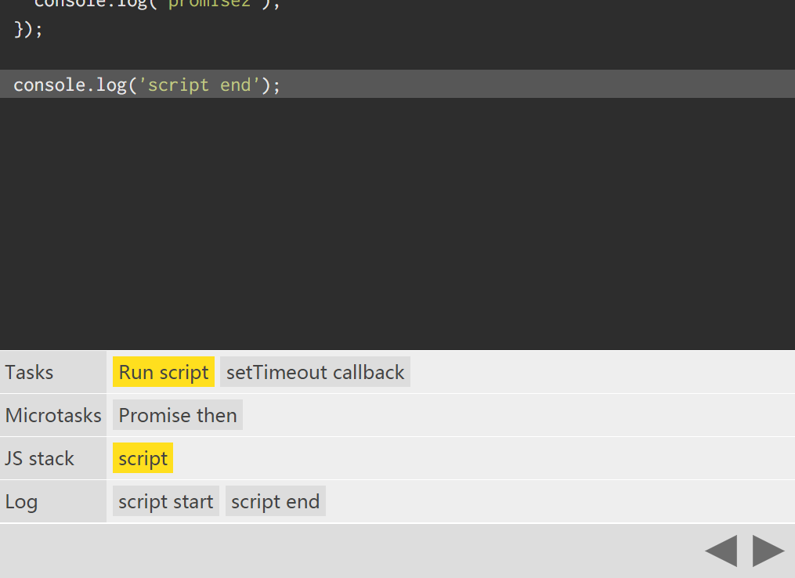

Vue 倡导开发者尽量不直接操作 DOM，但有的时候由于各种需求让开发者不得不这样做，于是 **nextTick** 的实现就是让开发者在修改数据后，能够在数据更新到 DOM 后才执行对应的函数，从而获取最新的 DON 数据。

那么如何实现 **nextTick**呢，我们首先可以想到的是利用 **setTimeout** 的异步回调来实现，不过由于各个浏览器的不同，setTimeout 的延迟很高，因此在 **nextTick** 中只作为最后的备胎，首选的方案则是 **MutationObserver**(在后面的内容中 MO 代表 MutationObserver)

## nextTick 的源码实现
```
export const nextTick = (function () {
  var callbacks = []
  var pending = false
  var timerFunc
  function nextTickHandler () {
    pending = false
    var copies = callbacks.slice(0)
    callbacks = []
    for (var i = 0; i < copies.length; i++) {
      copies[i]()
    }
  }
  /* istanbul ignore if */
  if (typeof MutationObserver !== 'undefined') { // 首选 MutationObserver 
    var counter = 1
    var observer = new MutationObserver(nextTickHandler) // 声明 MO 和回调函数
    var textNode = document.createTextNode(counter)
    observer.observe(textNode, { // 监听 textNode 这个文本节点
      characterData: true // 一旦文本改变则触发回调函数 nextTickHandler
    })
    timerFunc = function () {
      counter = (counter + 1) % 2 // 每次执行 timeFunc 都会让文本在 1 和 0 间切换
      textNode.data = counter
    }
  } else {
    timerFunc = setTimeout // 如果不支持 MutationObserver, 退选 setTimeout
  }
  return function (cb, ctx) {
    var func = ctx
      ? function () { cb.call(ctx) }
      : cb
    callbacks.push(func)
    if (pending) return
    pending = true
    timerFunc(nextTickHandler, 0)
  }
})()
```

## MutationObserver 的功能和作用

> MO 给开发者提供了一种能在某个范围内的DOM数发生变化时作出适当反应的能力 ——[MDN](https://developer.mozilla.org/zh-CN/docs/Web/API/MutationObserver)

用人话说是开发者能通过它创建一个观察者对象，这个对象会监听某个DOM元素，并在它的DOM树发生变化时执行我们提供的回调函数。

具体参考这个 [DEMO](https://jsfiddle.net/chenjsh36/1b5LL0b7/1/)

比较特别的是实例化的时候需要先传入回调函数：
```
var observer = new MutationObserver(function(mutations) {
  mutations.forEach(function(mutation) {
    console.log(mutation.type);
  })
})
```

然后才配置观察选项，包括观察节点和观察的属性：

```
// 选择目标节点
var target = document.querySelector('#some-id');
 
// 配置观察选项:
var config = { attributes: true, childList: true, characterData: true }
 
// 传入目标节点和观察选项
observer.observe(target, config);
 
// 随后,你还可以停止观察
observer.disconnect();
```

对于老版本的谷歌和火狐，则需要使用带前缀的 MO：
```
var MutationObserver = window.MutationObserver || window.WebKitMutationObserver || window.MozMutationObserver

```


### MutationObserver 和 microtask
那么为什么优选使用 MutationObserver呢？

一开始以为是 MO 就是用来监听 DOM 变化的，那么使用 textnode 模拟 DOM 变化再利用 MO 来监听触发从而实现 nextTick 不就很适合，直到了解看到了知乎上的[问答](https://www.zhihu.com/question/55364497)才知道是因为 MO 会比 setTimeout 早执行的缘故，

这里需要了解**JS的运行运行机制**（重新刷新了我的三观）, JS 的事件运行机制执行的时候会区分 **task** 和 **microtask**, 引擎在每个 **task** 执行完毕，并在从队列里取**下一个task来执行之前**， 执行完所有的 **microtask** 队列中的 microtask


(task 和 microtask 摘自 https://jakearchibald.com/)


** setTimeout** 回调会被分配到一个新的task中等待执行，而 Promise 的 resolver、MO 的 回调都会被分配到 microtask 的队列中，所以会比 setTimout 先执行

除了比 setTimout 快之外，还有 **渲染性能** 的问题，根据[HTML Standard](https://html.spec.whatwg.org/multipage/webappapis.html#event-loop-processing-model), **每个 task 运行完以后， UI 都会重新渲染，那么在 microtask 中就完成数据更新， 当前 task 结束就可以得到最新的 UI， 反之如果新建一个 task 来做数据更新，那么渲染就会进行两次。**

所以性价比如此高的 MO 自然成为了首选

关于 microtask，具体可以阅读 Jake 写的 [Tasks, microtasks, queues and schedules](https://jakearchibald.com/2015/tasks-microtasks-queues-and-schedules/)

### nextTick 的版本迭代
上面关于 **nextTick** 的源码实现属于 vue 最早的版本 v1.0.9，在深挖 mutationObserver 的时候发现 **nextTick** 在vue的版本迭代中也在不断的进化，同事也发生过退化，非常有趣：

先说说退化的事件，尤大（vue的作者）曾经使用 ```window.postMessage``` 来替代 MO 实现 nextTick，结果开发者使用后发现了问题，可以看看这两个 JSFiddle：[jsfiddle1](https://jsfiddle.net/k6bgu2z6/4/) 和 [jsfiddle2](https://jsfiddle.net/v9q9L0hw/2/), 两个例子用了不同版本来实现元素的绝对定位，第一个使用的是 2.0.0-rc6，这个版本采用的是 MO，而后来因为 IOS 9.3 的 WebView 里 MO 有 bug，尤大便换成 window.postMessage来实现，即第二个实例版本为 2.0.0-rc7, 但是由于 postMessage 会将回调放到 macrotask 其实也就是 task 里面，导致可能执行了多次 UI 的task都没有执行 window.postMessage 的 task，也就延迟了更新DOM操作的时间。尤大在后续版本撤回了这一次修改，具体的讨论可以看[issue](https://github.com/vuejs/vue/issues/3771#issuecomment-249692588)

关于进化，在后续的版本里，由于 es6 的新语法，nextTick 开始使用 Promise.then 和 MO 来做首选和次选，在前面的讨论中已经提到，Promise.then 也属于 microtask。


## 资源

* [MutationObserver MDN](https://www.baidu.com/link?url=LYghZ1U6I__rL8tyIBe3-xzXrcgeg0NWG_q2WdGfBVJrh730scgrhNnFsLX9CSze4erqXXiVityeMPmlPJy1W-kZ-dBSZ-FZ2menft7DURa&wd=&eqid=ef7669e10000d076000000065997b016)
* [Tasks, microtasks, queues and schedules](https://jakearchibald.com/2015/tasks-microtasks-queues-and-schedules/)